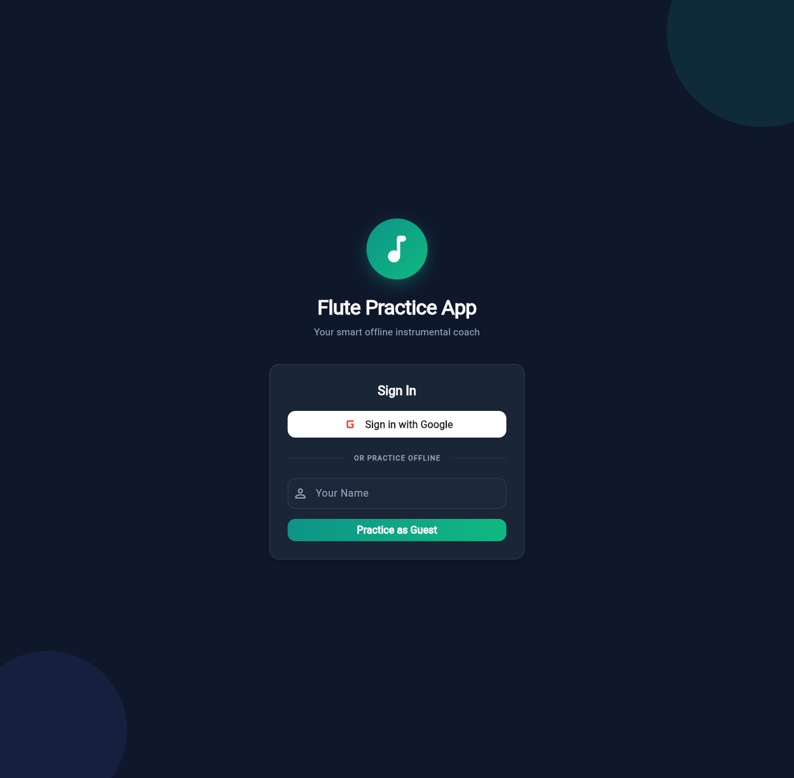
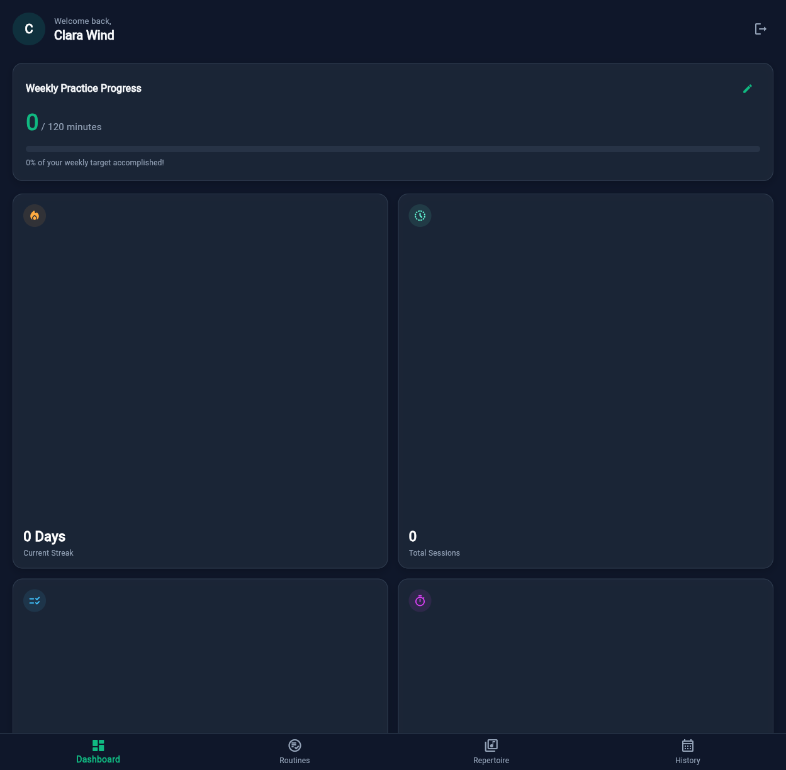
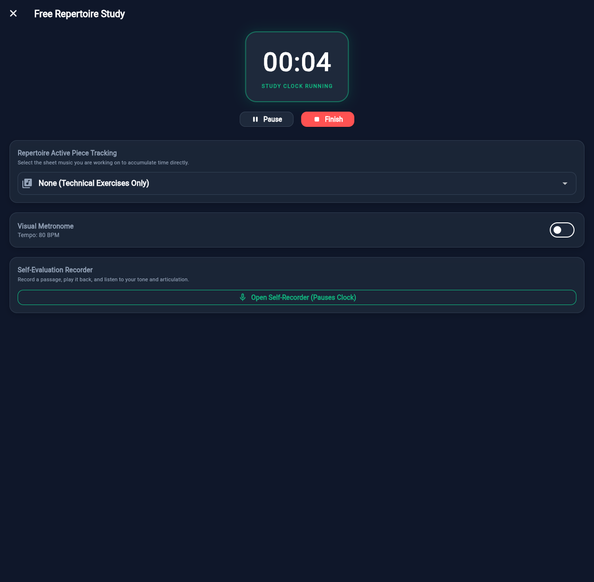
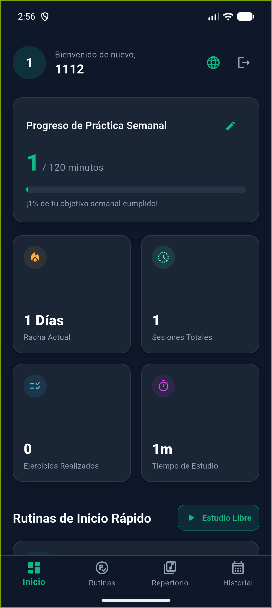
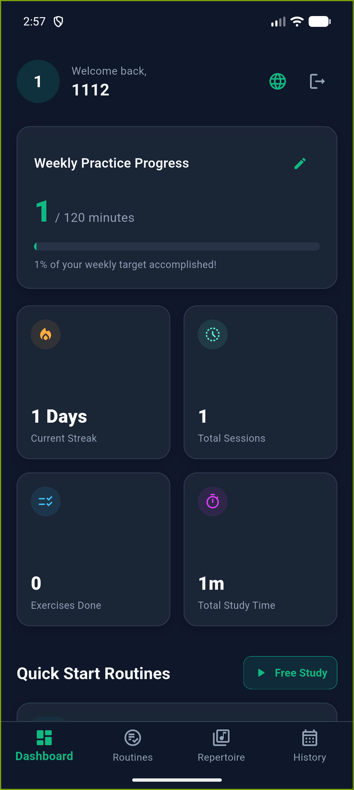
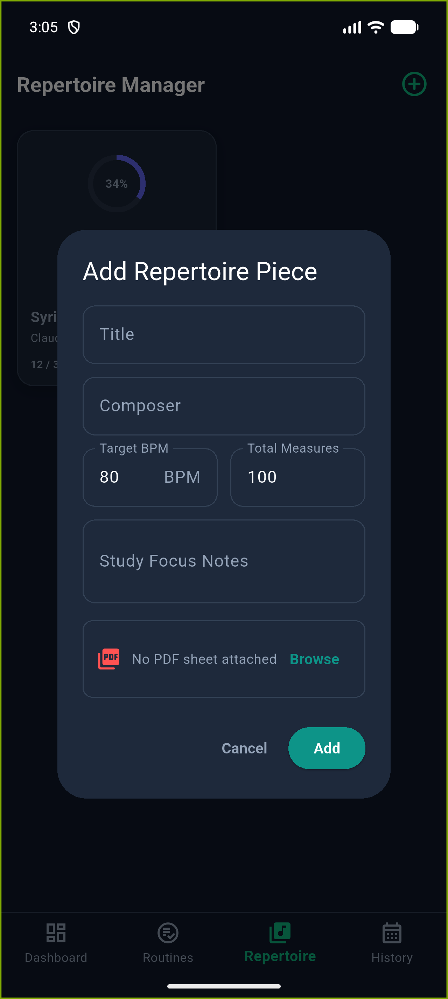
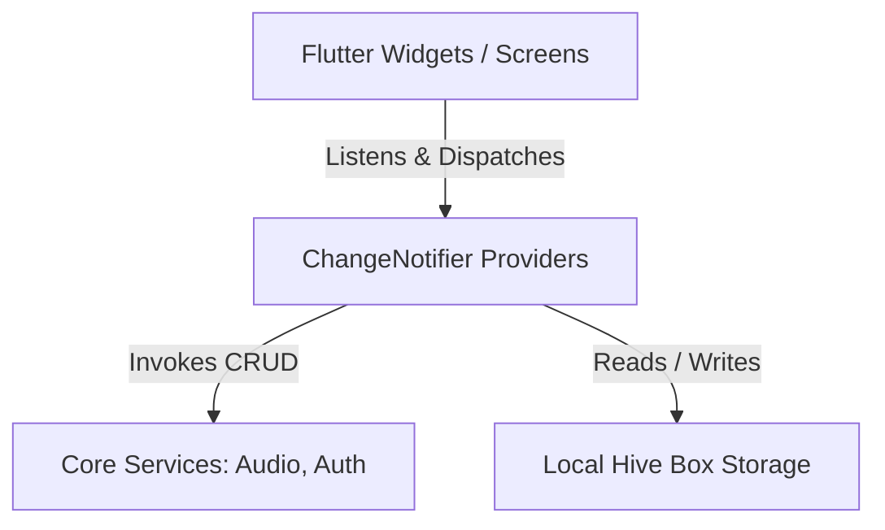

# Flute Practice App 🎵

[](https://github.com/seagomezar/music-journal-app/actions/workflows/android-release.yml)
[](https://flutter.dev)
[](https://pub.dev/packages/hive)
[](https://opensource.org/licenses/MIT)

An AI-powered instrumental coach and practice journal designed to optimize study routines, structure technical exercises, organize repertoire, and provide visual progress feedback for flutists. Built with a robust offline-first architecture using Flutter.

---

## 📸 App Mockups & Interface

### Desktop / Web Layout
| **Onboarding & Authentication** | **Dashboard & Routine Start** | **Active Rehearsal Suite** |
|:---:|:---:|:---:|
|  |  |  |

### Android Layout
| **Multilingual Login (ES)** | **Dashboard Overview (EN)** | **Dynamic Binder Add Piece** |
|:---:|:---:|:---:|
|  |  |  |

---

## ✨ Core Features

*   **📅 Technical Routines Configurator**: Create and manage detailed technical practice schedules, breaking down key exercises (scales, long tones, articulation drills) with target tempos (BPM) and key parameters.
*   **📚 binder Repertoire Catalog**: Track your musical pieces by composer, measures worked, and upload PDFs of sheet music directly.
*   **⏱️ Real-Time Rehearsal state-machine**: Integrated stopwatch chronometer, interactive metronome visualizer, self-assessment note-taking pane, and an inline audio recorder.
*   **📊 Practice Analytics**: Dynamic streaks trackers, weekly practice goal progress meters, and session duration breakdowns populated in real-time.
*   **🎙️ Smart Audio Practice Recorder**: record and playback practices directly within the calendar history player interface.
*   **🌐 Real-Time Bilingual Toggle**: Dynamic, stateful transition between English and Spanish locales in a single tap without app restart.

---

## 🛠️ Technical Architecture

The application adopts a clean, decoupled MVVM architecture optimized for offline-first performance:



### Stack Components
*   **Storage**: [Hive](https://pub.dev/packages/hive) - A lightweight, ultra-fast NoSQL database written in pure Dart, ensuring zero cold-start delay.
*   **Audio Recording & Playback**: [record](https://pub.dev/packages/record) for microphone capture and [audioplayers](https://pub.dev/packages/audioplayers) for localized audio playback.
*   **State Management**: [Provider](https://pub.dev/packages/provider) architecture separates reactive UI states from localized persistence hooks.

---

## 🚀 CI/CD Release Pipeline

A fully-automated build pipeline is configured using GitHub Actions under `.github/workflows/android-release.yml`:

*   **Triggers**: Fires on every Pull Request to `main` (for code verification) and every push/merge to `main` (for official builds).
*   **Signing Strategy**:
    *   **Signed Release**: Checks for GitHub Repository Secrets (`ANDROID_KEYSTORE_BASE64` etc.). If present, it compiles and signs with the production key. If absent, the runner dynamically compiles a **self-signed fallback key** via JDK's `keytool` ensuring the release APK is signed and immediately installable for staging.
    *   **Unsigned Release**: The pipeline performs a clean build separating signing configurations to generate standard unsigned APKs & App Bundles (AAB).
*   **Releases**: Automates draft releases and uploads the compiled APKs and AABs to the GitHub Releases page with matching incremental version tags (`v1.0.${{ github.run_number }}`).
*   **Modern Environments**: Fully compliant with GitHub Actions Node.js 24 runner specifications.

---

## 🌿 Gitflow Branching & Commits

To ensure clean teamwork and version history, the project adheres to the standard **Gitflow Branching Model**:

*   **`main`**: Production-ready code. Commits here automatically trigger Google Play Store/Draft releases.
*   **`develop`**: Workspace integration branch. New features branch off here.

### Conventional Commits
All commits follow the Conventional Commits specification:
*   `feat: ...` for new features (e.g. adding metronome widget).
*   `fix: ...` for bug fixes (e.g. resolving layout constraints).
*   `refactor: ...` for code enhancements.
*   `ci: ...` for runner/release changes.

---

## 💻 Getting Started

### Prerequisites
*   Flutter SDK: `v3.22.0` or higher.
*   Android Studio / Xcode (for mobile deployments).

### Install Dependencies
```bash
flutter pub get
```

### Run Locally
```bash
flutter run
```

### Build Releases Locally
To compile release bundles locally:
```bash
# Build APK
flutter build apk --release

# Build App Bundle (AAB)
flutter build appbundle --release
```

---

## 📄 License
This project is licensed under the MIT License - see the [LICENSE](LICENSE) file for details.
